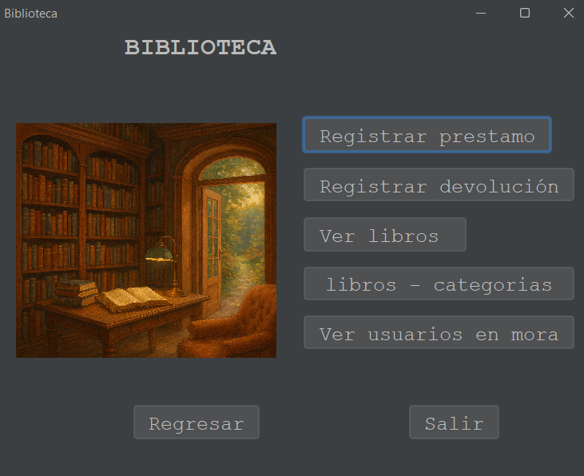
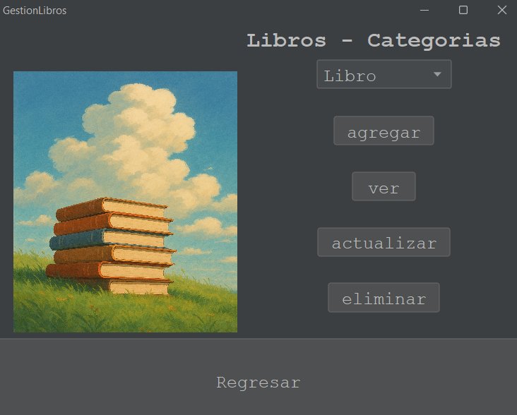

# Mini Project #3 – Event-Driven Programming: Library Management and Data Persistence 📚💻

## Description 📝

This project involves developing a Java application to manage book loans in a library, implementing persistence properties and utilizing event-driven programming principles. The application allows the management of book categories, loan registration, librarian account management, and applying fines for overdue book returns.

  

---

---

## Requirements ✅

The application meets the following conditions:

1. **Book Categories:** 
   - Three categories of books are available: **Horror** 🎃, **Classic Novels** 📖, and **Engineering** ⚙️.
   - Each category contains at least 5 books.

2. **Book and Category Management:** 
   - Librarians can add or remove books and categories from the library.

3. **Librarian Account System:** 
   - A login system is implemented for librarians.
   - Librarians can report book loans and returns, including the user's name who borrowed the book.

4. **Loan Management:** 
   - Books on loan cannot be loaned out again until returned.
   - The number of days a book is on loan is tracked, and if it exceeds 7 days, a fine of 1000 pesos per overdue day is applied.

5. **Master Librarian:** 
   - There is at least one master librarian who has the ability to create or delete other librarian accounts (both master and regular librarians).

6. **Status Reports:** 
   - A menu option displays the status of books by category.
   - Another menu option displays users with overdue books.

7. **Data Persistence:** 
   - The data for books, users, and librarians is stored persistently using **object serialization** in binary files (`*.bin` or `*.ser`).

---

## Project Structure 🏗️

The project is structured into the following main classes:

1. **Book:** Represents each book with its title, author, category, and status (available or on loan).
2. **Category:** Defines the three book categories and allows adding or removing books from each category.
3. **Librarian:** Represents the librarians, including attributes like name, type (regular or master), and login credentials.
4. **Loan:** Manages the records of book loans, including the loan and return dates, and calculates fines for overdue books.
5. **Library:** Controls the management of the library, including books, categories, users, and librarians. It also handles the persistence logic.
6. **Menu:** Responsible for displaying user options and managing user interactions.
7. **Persistence:** Implements object serialization and deserialization for storing and retrieving data.

---

## Requirements 📦

- **Java 8 or higher** is required to compile and run the application.
- **Recommended IDE:** IntelliJ IDEA or Eclipse.
- **Object Serialization Library** to store and retrieve data in binary files.

---

## How to Use 🛠️

1. **Running the Application:** 
   - Open the project in your preferred IDE.
   - Compile and run the main class containing the application's menu.

2. **Login:** 
   - Librarians must log in with their credentials.
   - The master librarian has access to create and delete accounts.

3. **Available Operations:** 
   - **Manage Books:** Add or remove books.
   - **Loan Books:** Register a book loan.
   - **Return Books:** Return a book and calculate the loan days.
   - **View Book Status:** See the status of books by category.
   - **Overdue Users:** View users with overdue books.

4. **Persistence:** 
   - Data is saved in binary files (`library.ser`) to retain the state between sessions.

---

## Class Diagrams 🖼️

Below are the class diagrams showing the relationships between the main classes of the system.

(Attach class diagrams here)

---

## Persistence Implementation 💾

Data persistence is handled using **object serialization** in binary files. When the application starts, previously stored data is loaded from the respective `.ser` files. When changes are made (such as adding or removing books or librarians), they are automatically saved to the persistence files.

---

## Results and Presentation 🎤

The functionality of the application will be presented in class. The demonstration will cover how book loans are managed, fines are applied, and data persistence is handled. The results of application testing will also be shared.

---

## Final Considerations ⚙️

- This project is a simple yet complete implementation of a library system with book loan management, user accounts, and data persistence.
- It utilizes fundamental concepts of **event-driven programming** and **object serialization** in Java to ensure the application is robust and maintainable.

The functionality of the application will be presented in class. The demonstration will cover how book loans are managed, fines are applied, and data persistence is handled. The results of application testing will also be shared.

## Final Considerations ⚙️

- This project is a simple yet complete implementation of a library system with book loan management, user accounts, and data persistence.
- It utilizes fundamental concepts of **event-driven programming** and **object serialization** in Java to ensure the application is robust and maintainable.
